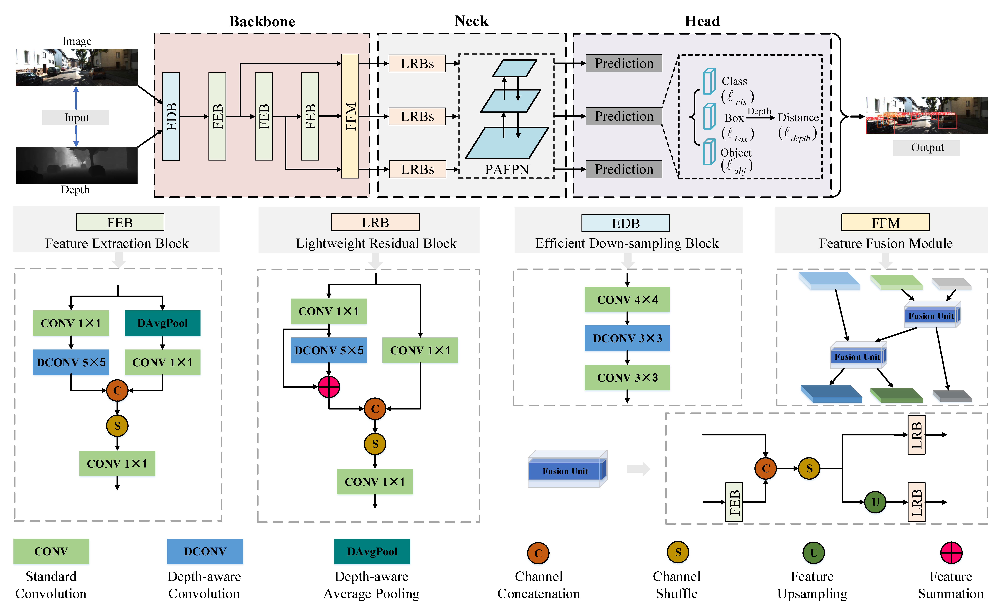

# DALDet
[AAAI2024] DALDet: Depth-aware Learning Based Object Detection for Autonomous Driving

## Introduction
3D object detection achieves good detection performance in autonomous driving. However, it requires substantial computational resources, which prevents its practical application. 2D object 
detection has less computational burden but lacks spatial and geometric information embedded in depth. Therefore, we present DALDet, an efficient depth-aware learning based 2D detector, achieving 
high-performance object detection for autonomous driving. We design an efficient one-stage detection framework and seamlessly integrate depth cues into convolutional neural network by introducing 
depth-aware convolution and depth-aware average pooling, which effectively improve the detector's ability to perceive 3D space. Moreover, we propose a depth-guided loss function for training 
DALDet, which effectively improves the localization ability of the detector. Due to the use of depth map, DALDet can also output the distance of the object, which is of great importance for driving
 applications such as obstacle avoidance. Extensive experiments demonstrate the superiority and efficiency of DALDet.

<br/>
<div align="center">
  

  Fig. 1: Overall architecture of the proposed DALDet.
</div>

## Prerequisites
This work was tested with Python 3.8.10, CUDA 11.3, and Ubuntu 20.04.

## Installation
```bash
# create virtual environment and install requirements
conda create -n DALDet python=3.8
conda activate DALDet
conda install pytorch==1.10.0 torchvision==0.11.1 cudatoolkit=11.3 -c pytorch
pip install -r requirements.txt

# You should also install depth-aware convolution and depth-aware average pooling.
# In project root directory:
cd additions/ops/depthconv
python setup.py install
cd ../depthavgpooling/
python setup.py install

# You should also install 'additions' module for easy import.
# In project root directory:
pip install -e .
```

## Data Preparation
You should put the data in the correct place in the following form.
```bash
dataset
├──kitti
│    ├── images # left images
│    │   ├── train_set
│    │   └── val_set
│    ├── depths # depth maps
│    │   ├── train_set
│    │   └── val_set
│    ├── labels # labels in txt format (yolo format)
│    │   ├── train_set
│    │   └── val_set
│    └── meta # meta data, includes: train_set.txt, val_set.txt 
```

The dataset can be downloaded at (https://www.cvlibs.net/datasets/kitti/eval_object.php?obj_benchmark=2d). The dataset split follows Chen et al in 3D Object Proposals for Accurate Object Class Detection. And the depth maps are generated by [IGEV-Stereo](https://github.com/gangweiX/IGEV).

## Training

You can run `train.py` with args in command lines:

```bash
CUDA_VISIBLE_DEVICES=0 python train.py {--args}
```


## Evaluation

You should run `detect.py` to get detection results (saved in `.txt` format) first, then use the official codes (in the `kitti_eval` folder) for evaluation:

```bash
CUDA_VISIBLE_DEVICES=0 python detect.py {--args}

# In project root directory:
cd kitti_eval
./evaluate_object_3d_offline ./validate_set/label ./validate_set/result
```

## Citation
If you find this repository useful, please consider citing:

```
@inproceedings{hu2024daldet,
  title={DALDet: Depth-Aware Learning Based Object Detection for Autonomous Driving},
  author={Hu, Ke and Cao, Tongbo and Li, Yuan and Chen, Song and Kang, Yi},
  booktitle={Proceedings of the AAAI Conference on Artificial Intelligence},
  volume={38},
  number={3},
  pages={2229--2237},
  year={2024}
}
```

## Acknowledgements
This implementation is based on the following repositories, and we thank the original authors for their excellent works.
- [YOLOv5](https://github.com/ultralytics/yolov5)
- [DepthAwareCNN](https://github.com/laughtervv/DepthAwareCNN)
- [DepthAwareCNN-pytorch1.5](https://github.com/crmauceri/DepthAwareCNN-pytorch1.5)